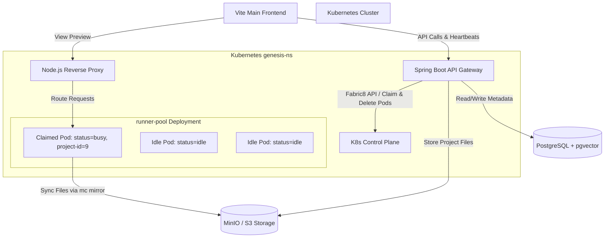
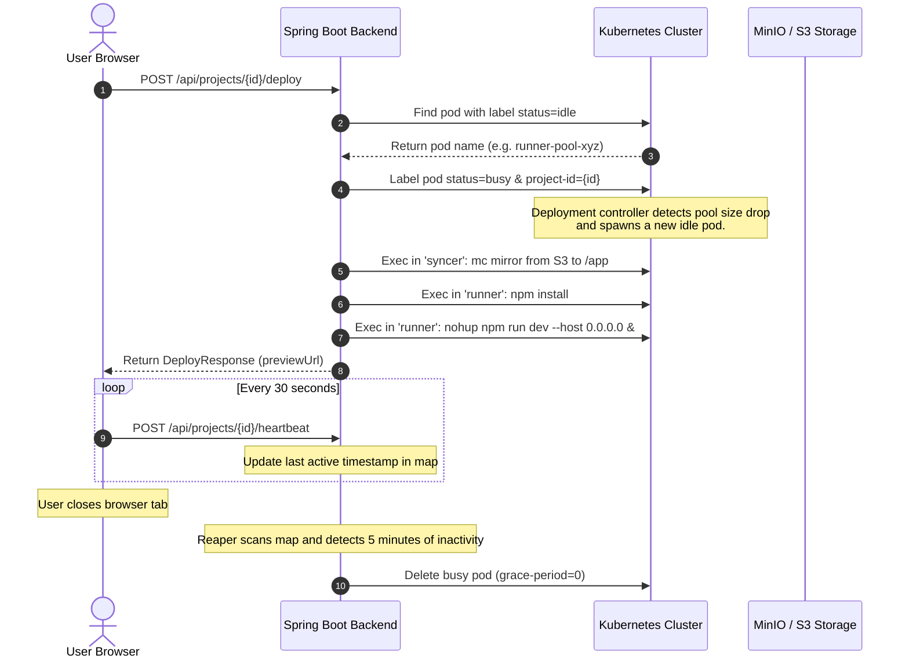

# Lovable Clone: Architecture & Deployment Documentation

This document provides a comprehensive overview of the **Lovable Clone** application architecture, component interactions, runtime environment design, and detailed deployment guidelines.

---

## 1. System Architecture Diagram



---

## 2. Component Breakdown

### A. Spring Boot Backend
The core engine of the application, responsible for:
* **Project Management**: Creation, updating, and membership permissions.
* **LLM Engine**: Integration with OpenAI via **Spring AI** for code generation.
* **Dynamic Previews**: Communicating with the Kubernetes API using the Fabric8 client to claim pre-warmed workspace containers, sync code files, and start development servers.
* **Pod Life Cycle & Reaper**: Monitoring project activity via client heartbeats, and automatically deleting inactive preview pods after a configurable timeout (defaults to 5 minutes).
* **Billing**: Stripe payment processing and subscription webhook handling.

### B. Kubernetes Runner Pool (`genesis-ns`)
To provide near-instant sandbox workspace initialization, the system uses a **pre-warmed pool pattern**:
* **`runner-pool` Deployment**: Maintains a set of replica pods (`status=idle`).
* **Pod Architecture (Multi-Container)**:
  * **`syncer` Container** (`minio/mc`): Used by the backend to fetch project source files from MinIO/S3 using the MinIO CLI (`mc mirror`) and watch for modifications (`mc mirror --watch`).
  * **`runner` Container** (`node:20-alpine`): Houses the node runtime. Runs `npm install` and boots up the Vite development server (`npm run dev`) on port `5173`.
  * **Shared Volume**: An `emptyDir` volume mounted at `/app` sharing files between the `syncer` and `runner` containers.

### C. Node.js Reverse Proxy
A proxy service (`ioredis` + `http-proxy`) that intercepts preview requests (e.g. `project-15.app.domain.com:8090`) and dynamically forwards the HTTP traffic to the internal IP address and port of the corresponding claimed runner pod in Kubernetes.

---

## 3. Dynamic Deployment Workflow



---

## 4. Configuration Properties

### Spring Boot (`application.yaml`)

| Property | Default Value | Description |
| :--- | :--- | :--- |
| `app.preview.idle-timeout` | `5m` (5 minutes) | Inactivity duration before the pod is automatically reaped. Set to `30s` locally. |
| `spring.ai.openai.api-key` | `${OPENAI_API_KEY}` | OpenAI token used for prompt code generations. |
| `minio.url` | `http://localhost:9000` | S3 endpoint URL. |
| `minio.bucket` | `lovable` | S3 bucket containing project workspace folders. |

---

## 5. Deployment Commands Cheat Sheet

### Local Setup (Development)

1. **Change default namespace**:
   ```bash
   kubectl config set-context --current --namespace=genesis-ns
   ```
2. **Apply Local Services**:
   ```bash
   kubectl apply -f k8s/infra.yml
   ```
3. **Deploy Runner Pool**:
   ```bash
   kubectl apply -f k8s/runner-pods.yml
   ```
4. **Delete and Recreate Namespace (Clean Slate)**:
   ```bash
   kubectl delete namespace genesis-ns
   kubectl create namespace genesis-ns
   ```

### Production Setup

1. **Create Kubernetes Secrets**:
   ```bash
   kubectl create secret generic lovable-secrets -n genesis-ns \
     --from-literal=openai-api-key="sk-..." \
     --from-literal=stripe-secret-key="sk_..." \
     --from-literal=jwt-secret-key="your-jwt-secret-key"
   ```
2. **Build and Push Backend Image**:
   ```bash
   docker build -t yourusername/lovable-backend:latest .
   docker push yourusername/lovable-backend:latest
   ```
3. **Deploy Backend to Cluster**:
   ```bash
   kubectl apply -f k8s/backend.yml
   ```
