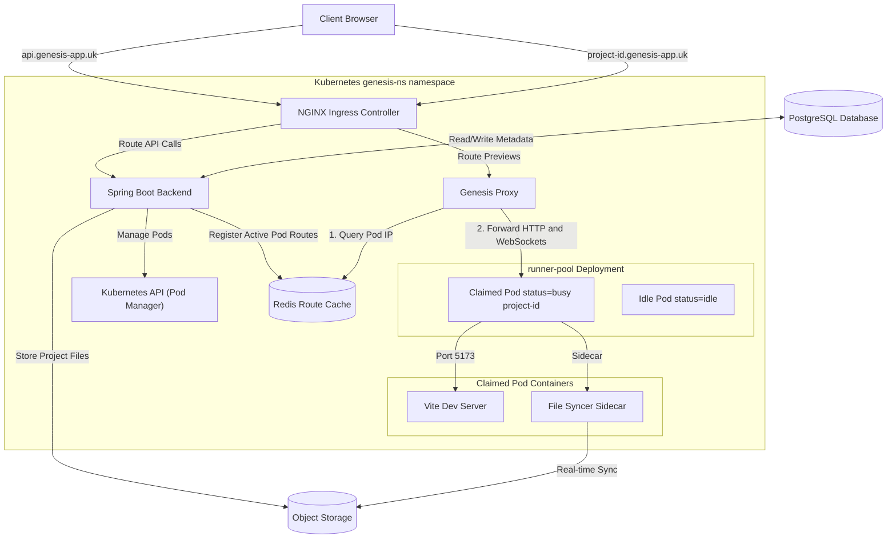

<p align="center">
  
  
  
  
</p>

# Genesis — AI-Powered React Application Builder

Genesis is an AI-powered React application generator inspired by [Lovable.dev](https://lovable.dev). Users describe what they want to build in plain English, and an AI agent generates a complete React + Vite codebase in real-time. Every project gets its own live preview URL — a real Vite dev server running inside a dynamically provisioned Kubernetes pod, with hot module replacement streaming changes back to the browser instantly.

The backend is built with **Spring Boot** and **Spring AI**, deployed on a **DigitalOcean Kubernetes** cluster. The frontend (React + Vite + Tailwind) lives in a separate repository.

### Why Kubernetes?
Genesis uses Kubernetes to provide isolated preview environments for each project. Every preview runs inside its own container, allowing users to interact with a real Vite development server rather than a simulated browser sandbox. This enables accurate builds, hot module replacement, and independent lifecycle management for each project preview.

| | Link |
|---|---|
| 🌐 **Live Demo** | [genesis-app.uk](https://genesis-app.uk) |
| 🎨 **Frontend Repo** | [subham3604/lovable-frontend](https://github.com/subham3604/lovable-frontend) |
| ⚙️ **Backend Repo** | [subham3604/lovable](https://github.com/subham3604/lovable) |
| 📖 **API Docs (Swagger)** | [api.genesis-app.uk/swagger-ui](https://api.genesis-app.uk/swagger-ui/index.html) |

> *Note: The live demo runs on a single-node development cluster with limited resources (2GB RAM). Additionally, due to API budget limits, the demo uses `gpt-4o-mini`, so code generation quality may be lower than current standards. The model is configurable via `configmap.yml`.*

---

## System Architecture



> For detailed Kubernetes resource tables and pod internals, see [docs/architecture.md](docs/architecture.md).

---

## Features

- **AI Code Generation** — Describe your app in plain English and watch the AI generate a complete React codebase in real-time via streaming SSE.
- **Live Preview** — Every project gets a unique subdomain (`project-{id}.genesis-app.uk`) running a live Vite dev server with hot module replacement.
- **Project Management** — Full CRUD with role-based collaboration (Owner / Editor / Viewer).
- **Subscription Billing** — Stripe-powered checkout, customer portal, and usage-based metering.
- **File Storage** — S3-compatible object storage (Cloudflare R2) with automatic file syncing to runner pods.
- **Kubernetes Orchestration** — Dynamic pod provisioning from a warm pool, Redis-backed service discovery, and automatic idle cleanup.
- **Authentication** — Stateless JWT-based auth with email/password signup.

---

## How It Works — End to End

### 1. User Creates a Project
The user creates a new project from the frontend. The backend scaffolds a starter Vite + React + TypeScript template by copying files from a pre-seeded R2 bucket into the project's storage directory, and saves the file tree metadata to PostgreSQL.

### 2. User Sends a Chat Prompt
The frontend opens an SSE connection to `POST /api/chat/stream`. The backend:
1. Loads the **full file tree** and injects it into the AI system prompt as context.
2. Registers a `read_files` **tool** that the AI can call to read any existing project file before making edits.
3. Streams the AI response token-by-token to the frontend.
4. On completion, parses the response for file tags, saves edited files to R2 + PostgreSQL, and persists chat history.

### 3. User Deploys the Preview
When the user clicks "Preview", the backend:
1. Claims an **idle runner pod** from the pre-warmed Kubernetes pool and labels it as `busy`.
2. Syncs all project files from R2 into the pod's shared workspace volume.
3. Starts a continuous background sync to pick up newly AI-generated files.
4. Runs `npm install && npm run dev` inside the runner container.
5. Registers the pod's IP in **Redis** and returns the preview URL to the frontend.

### 4. Preview Request Routing
When the browser navigates to `https://project-{id}.genesis-app.uk`:
1. **Cloudflare** terminates SSL and proxies to the DigitalOcean node.
2. **NGINX Ingress** matches the wildcard host and routes to the Genesis Proxy service.
3. **Genesis Proxy** queries Redis for the pod IP and forwards HTTP + WebSocket traffic to the Vite dev server.

### 5. Idle Cleanup
A scheduled task runs periodically. If a preview hasn't received a heartbeat within the configured timeout, the pod is released and the Redis route is cleaned up.

---

## Tech Stack

| Category | Technologies |
|---|---|
| **Backend** | Java, Spring Boot, Spring AI, Spring Security, Spring Data JPA, Hibernate |
| **AI** | OpenAI (configurable), tool calling, SSE streaming |
| **Database** | PostgreSQL, Redis |
| **Storage** | Cloudflare R2 (S3-compatible) |
| **Payments** | Stripe |
| **Infrastructure** | Kubernetes (DigitalOcean DOKS), Docker |
| **Networking** | NGINX Ingress, Cloudflare DNS/CDN, Let's Encrypt TLS |
| **Frontend** | React, TypeScript, Vite, Tailwind CSS |

---

## API Overview

Interactive Swagger UI: **[api.genesis-app.uk/swagger-ui](https://api.genesis-app.uk/swagger-ui/index.html)**

| API Group | Description |
|---|---|
| **Auth** (`/api/auth`) | JWT login and signup |
| **Projects** (`/api/projects`) | CRUD, deploy previews, heartbeat |
| **Chat** (`/api/chat`) | SSE streaming AI code generation |
| **Files** (`/api/projects/{id}/files`) | File tree and file content retrieval |
| **Billing** (`/api/plans`, `/api/payments`) | Stripe checkout, portal, webhooks |

> Full endpoint documentation: [docs/api.md](docs/api.md)

---

## Getting Started

```bash
git clone https://github.com/subham3604/lovable.git
cd lovable
./mvnw spring-boot:run
```

> [!IMPORTANT]
> **Full setup guide** (prerequisites, Docker Compose, environment config, frontend integration): [docs/local-development.md](docs/local-development.md)
>
> **Production deployment** (Docker build, Kubernetes manifests, environment variables): [docs/deployment.md](docs/deployment.md)

---

## Scalability & Future Architecture

### Current Horizontal Scalability
The architecture is designed to handle user growth by horizontally scaling the resource-heavy preview environments and using managed cloud primitives for storage and data persistence:
- **Runner Pod Pools**: The active and idle sandbox environments can autoscale horizontally via standard Kubernetes Horizontal Pod Autoscaling (HPA) to match concurrent user traffic.
- **Decoupled State**: Source code files are stored in serverless object storage, and transactional metadata lives in a PostgreSQL database, allowing stateless container restarts and load balancing.
- **Dynamic Ingress Routing**: The custom routing proxy dynamically routes user subdomains to specific preview environments using Redis caching, avoiding complex routing updates inside the Ingress controller.

### Modular Monolith & Microservices Tradeoffs
The backend currently operates as a **modular monolith**. This simplifies local development, reduces configuration complexity, and minimizes the resource overhead of a multi-service deployment. 

However, at massive scale, this monolith introduces key architectural bottlenecks:
1. **Thread & CPU Contention**: Long-running Server-Sent Events (SSE) connections and heavy token streaming during code generation can compete for request threads and CPU cycles needed by fast transactional endpoints (such as auth and billing).
2. **Asymmetric Resource Demands**: The components that manage Kubernetes pod orchestration have different scaling profiles and permissions compared to user-facing web endpoints.

**Future Extraction Paths**:
Should scale require it, the system can be decomposed into domain-specific microservices by extracting the **AI Processing Engine** and the **Kubernetes Pod Manager** into independent services. Because the system is already fully containerized and hosted in a Kubernetes namespace, these components can be decoupled incrementally into distinct deployments, enabling independent resource limits and isolated scaling boundaries without disrupting core application logic.

---

## License

This project is for educational and portfolio purposes.
