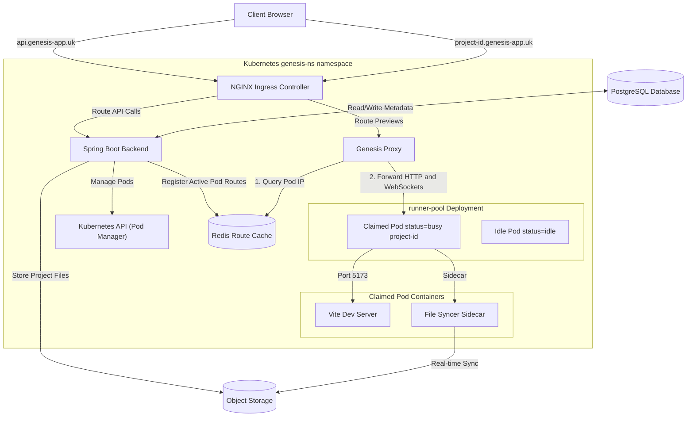
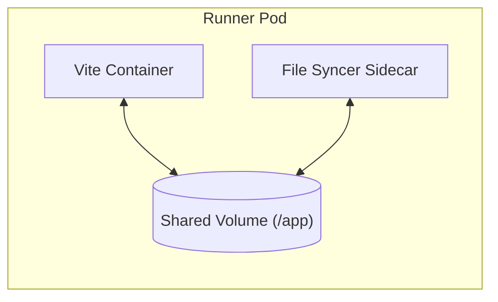

# System Architecture & Design Decisions

This document details the system design, dynamic routing mechanics, trade-offs, and failure recovery protocols of the Genesis platform.

---

## 1. System Architecture

The following diagram represents the core components of the Genesis system and how they interact across the network boundaries.

---

## 2. Kubernetes Cluster Components

To orchestrate isolated developer previews safely and cost-effectively, Genesis defines the following Kubernetes components:

- **Spring Boot Backend**: Serves user traffic (Auth, billing, projects), processes AI streaming, and calls the Kubernetes API using configured Service Account permissions to manage the lifecycle of runner pods.
- **Genesis Proxy**: A lightweight Node.js reverse proxy that intercepts wildcard subdomain requests and forwards traffic directly to active runner container IPs.
- **Runner Pod Pool**: A pool of pre-warmed, multi-container pods containing the Vite dev environment and a file synchronization sidecar.
- **Redis Route Cache**: An in-memory key-value store holding routing mappings (`project-subdomain` -> `pod-ip`).
- **NGINX Ingress Controller**: Manages wildcard SSL termination and routes requests based on Host headers (API endpoints vs. project subdomains).
- **Network Policies**: Secures the cluster by isolating active runner pods so they can only receive ingress traffic from the Genesis Proxy.
- **RBAC Service Account**: Grants the Spring Boot backend scoped permissions to inspect, label, and delete pods within the application namespace.

### Pod Architecture — Multi-Container Sandboxes
Each workspace preview runs inside a dedicated multi-container pod:

- **Vite Container**: Runs the React development environment on port `5173` with Hot Module Replacement (HMR) active.
- **File Syncer Sidecar**: Mounts the shared volume and runs a continuous loop mirroring code modifications from Object Storage into the workspace folder, causing Vite to trigger HMR updates in the browser.

---

## 3. Dynamic Request Routing

When serving dynamic subdomains (e.g., `https://project-123.genesis-app.uk`), routing requests directly via standard Kubernetes Ingress controllers introduces significant bottlenecks:
- **Ingress Reload Latency**: Updating NGINX or Traefik configuration rules for every claimed pod takes seconds to compile and reload, which degrades the user experience by introducing substantial connection delays when initiating a preview session.
- **Configuration Bloat**: Maintaining large numbers of dynamically changing ingress rules increases operational complexity and can introduce configuration reload overhead.

### The Proxy & Redis Solution
To bypass these issues, Genesis decouples ingress routing from Kubernetes configuration:
1. **Wildcard Ingress**: The NGINX Ingress Controller is configured with a wildcard rule (`*.genesis-app.uk`) pointing all preview traffic to a custom **Genesis Proxy** service.
2. **Fast Route Lookup**: The Genesis Proxy reads the incoming Host header, extracts the project identifier, and queries the **Redis Route Cache**. 
3. **HTTP/WebSocket Forwarding**: If a match is found, the proxy directly forwards the request (including WebSocket upgrade streams for Vite HMR) to the runner's pod IP. 

This enables fast routing updates (simple `SET` operations in Redis) without causing configuration updates or service reloads.

---

## 4. Key Design Decisions & Tradeoffs

### Pre-warmed Pod Pools
- **Decision**: Pre-allocating idle runner pods in a warm pool rather than provisioning containers on-demand.
- **Benefit**: Minimizes container provisioning delays (skipping Docker image pull and pod initialization latencies) when a user requests a preview.
- **Tradeoff**: Increases the baseline resource reservation in the cluster, leading to idle CPU and memory costs even during periods of low user traffic.

### Redis-Backed Dynamic Routing
- **Decision**: Storing mapping rules dynamically in Redis and handling them in a custom Node proxy to avoid Ingress reloads.
- **Benefit**: Eliminates dynamic Ingress configuration changes, enabling fast route resolution and updates.
- **Tradeoff**: Adds a dependency on a cache layer. If Redis becomes unavailable, the proxy cannot route incoming preview subdomains. However, Redis only stores *ephemeral routing metadata* (`project-subdomain` -> `pod-ip`). All project files and persistent states remain safe in Object Storage and PostgreSQL. If Redis is restarted or cleared, routes can be dynamically reconstructed from active pod states in the Kubernetes namespace.

### Serverless Object Storage
- **Decision**: Storing React codebase workspaces in serverless object storage rather than Persistent Volumes (PVs).
- **Benefit**: Decouples state from pod lifecycles, lowers storage costs, and provides effectively unbounded storage scaling.
- **Tradeoff**: Requires network synchronization when claiming a new pod, introducing initial loading sync time as files are copied from Object Storage to the container volume.

### Server-Sent Events (SSE) for AI Streams
- **Decision**: Utilizing Server-Sent Events to stream generated files and token updates incrementally.
- **Benefit**: Provides immediate visual feedback to the user, reducing perceived latency as code is written.
- **Tradeoff**: Uses simple HTTP transport but requires the backend to maintain long-lived connections and consumes backend resources for the duration of the stream.

---

## 5. Failure Recovery & Self-Healing

### Runner Pod Failure
If a claimed runner pod crashes or is terminated:
- The backend's health check will detect the missing pod.
- The system will allocate an available runner pod from the pre-warmed pool, or throw an exception if the pool is exhausted.
- The File Syncer sidecar automatically pulls the project codebase down from Object Storage, restoring the workspace state to the shared volume without user data loss.

### Route Expiration
To prevent route cache drift:
- Redis routing keys are configured with a Time-To-Live (TTL) matching the deployment's idle limit.
- If Redis keys expire or the routing cache is cleared, the Genesis Proxy will return a `404` or trigger the backend to re-verify the container status, dynamically restoring the route if the pod is still active.

### Idle Pod Reclamation (Reaping)
To prevent container resource leaks and contain cloud costs:
- The frontend sends periodic heartbeat requests while the user is actively viewing a preview.
- A scheduled manager task in the Spring Boot backend queries pod statuses and reclaims (deletes) runner pods that have not recorded a heartbeat within the idle threshold limit.

---

## 6. Security Isolation Model

Genesis implements security isolation at both the compute and storage layers:
- **Compute Isolation**: Every project preview runs in a dedicated, isolated runner pod in Kubernetes rather than sharing process namespaces or runtimes.
- **Network Isolation**: Kubernetes NetworkPolicies restrict ingress traffic to runner pods so that they only accept connections from the Genesis Proxy.
- **Access Control**: The backend uses an RBAC-scoped service account, restricting its API privileges only to pod management within its specific namespace.
- **Storage Security**: Codebase assets are persisted securely in Object Storage rather than inside ephemeral container layers, preventing data loss on container termination.
